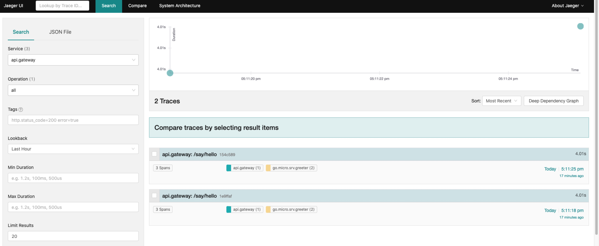

# go-micro-demo

## 安装

* proto编译器：brew install protobuf
* protoc-gen-go：go get github.com/golang/protobuf/protoc-gen-go@v1.3.2 (安装最新版本的protoc-gen-go运行会报错etcd undefined: resolver.BuildOption...)
* protoc-gen-micro：go get github.com/micro/micro/v2/cmd/protoc-gen-micro@master
* go-micro：go get github.com/micro/go-micro/v2
* micro：go get github.com/micro/micro/v2
* 服务注册与发现etcd：brew install etcd
* 链路追踪jaeger：
```
 docker run -d --name jaeger \
    -e COLLECTOR_ZIPKIN_HTTP_PORT=9411 \
    -p 5775:5775/udp \
    -p 6831:6831/udp \
    -p 6832:6832/udp \
    -p 5778:5778 \
    -p 16686:16686 \
    -p 14268:14268 \
    -p 9411:9411 \
    jaegertracing/all-in-one:1.18
```

## 运行

### 使用Gin作为网关

执行
```
etcd
docker start jaeger
```

```
cd go-micro-demo
make proto
go run service/main.go
go run gin/main.go
```

```
curl -XPOST -d '{"name":"kimi.wang"}' http://localhost:8888/say/hello
```

将会返回
```json
{"code":200,"data":{"msg":"hello kimi.wang","reply":"hello kimi.wang"},"msg":"success"}
```

访问 http://localhost:16686/


 
## 参考

* https://github.com/micro-in-cn/tutorials/tree/master/microservice-in-micro
* https://github.com/yuedun/micro-service
* https://github.com/micro/go-plugins/tree/master/wrapper